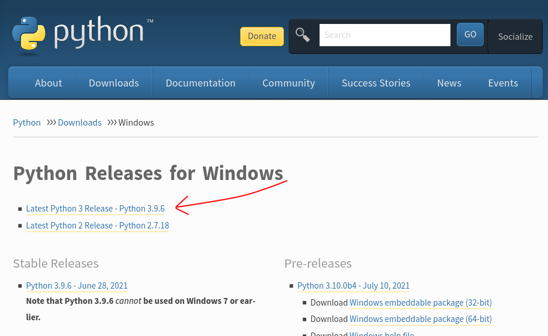
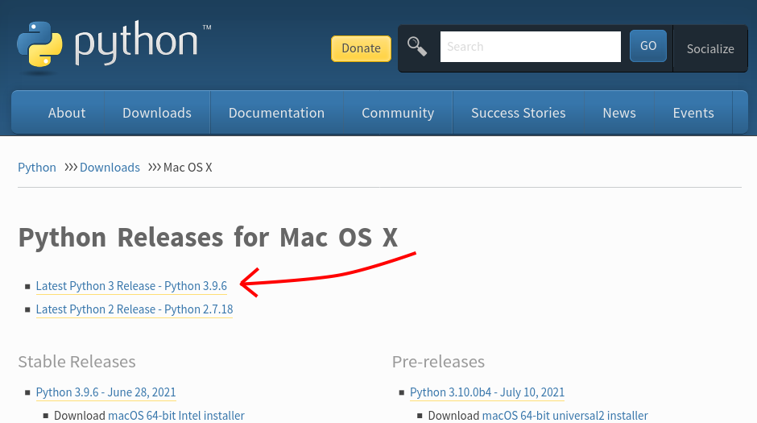
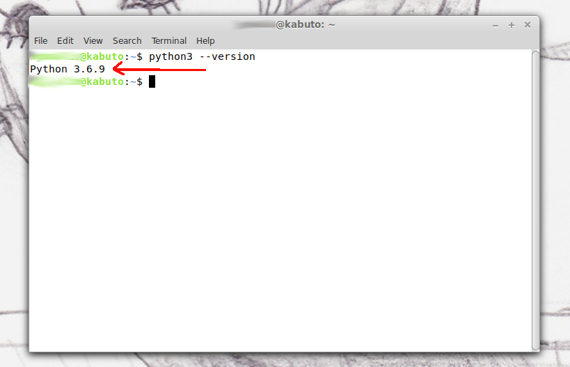
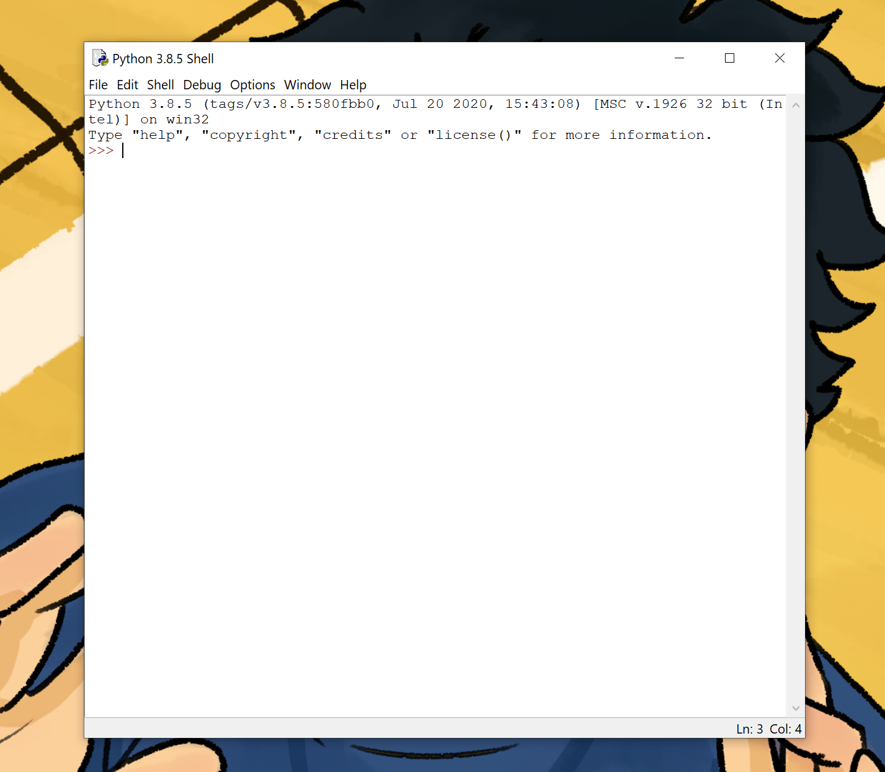
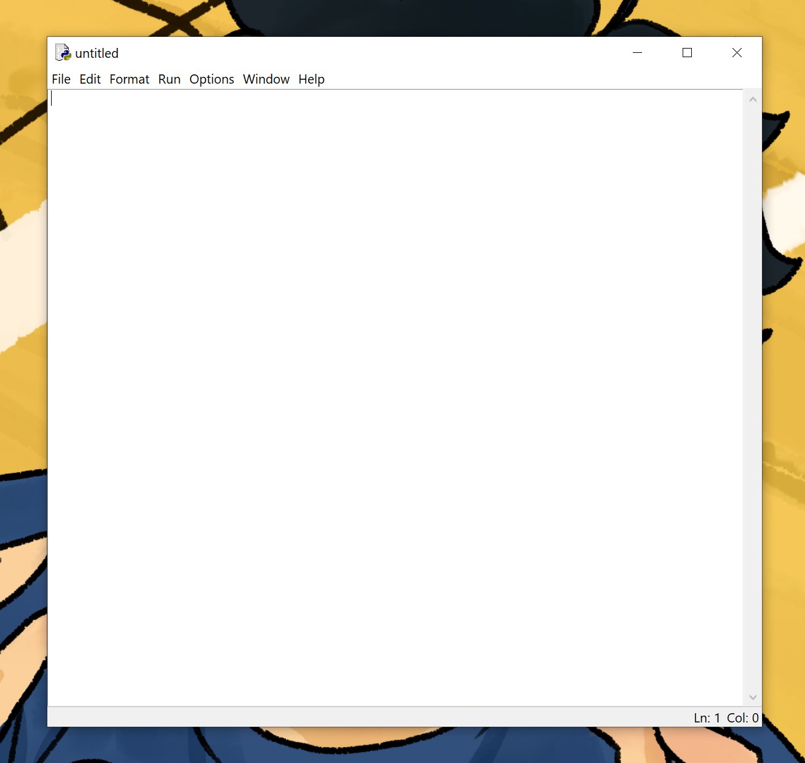
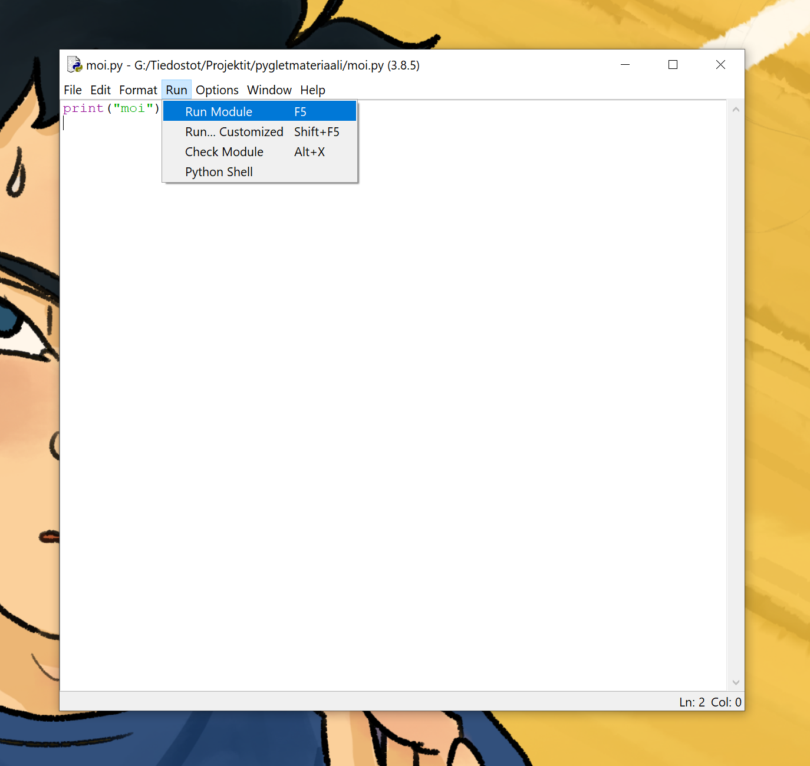
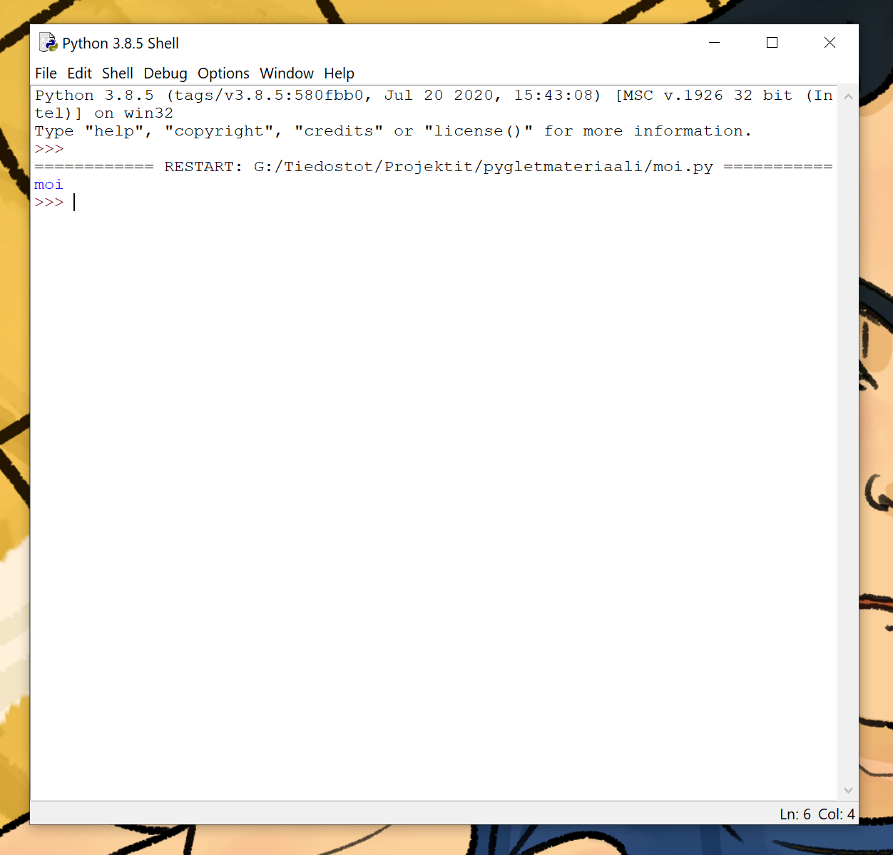
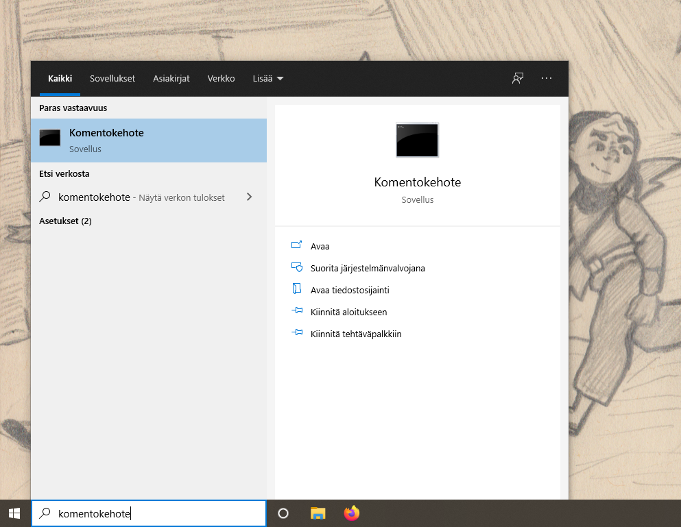
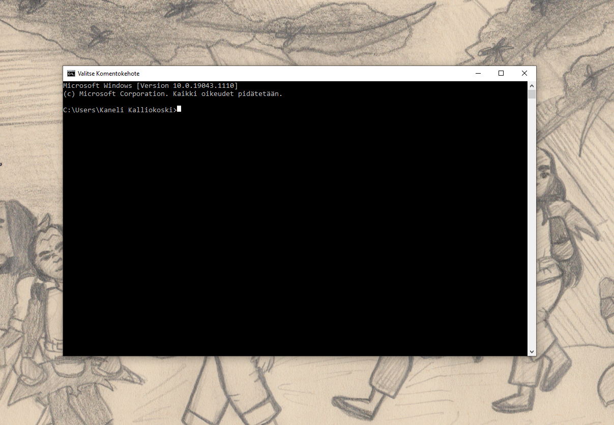

# Osa 0 - Python ja Pyglet

## Python

Python on ohjelmointikieli, eli jonkinlainen tapa kertoa tietokoneelle mitä sen pitää tehdä. 

### Miten asentaa Python omalle koneelle

Jotta tietokone osaa lukea Pythonilla kirjoitettua koodia, pitää koneelle olla asennettuna Python-tulkki. Tämän tulkin asennusta kutsutaan Pythonin asentamiseksi. Pythonilla on omat kotisivut [python.org](python.org), joilta Pythonin voi ladata. Pythonin asennus on hiukan erilaista riippuen siitä millaista tietokonetta käyttää.

#### Windows-koneelle asentaminen

Python Windowsille löytyy osoitteesta [https://www.python.org/downloads/windows/](https://www.python.org/downloads/windows/). Valitse sivulla olevista linkeistä _Latest Python 3 release_ eli viimeisin Python 3 -julkaisu.



Ladattuasi kyseisen paketin, suorita se ja asenna saamiesi ohjeiden mukaisesti.

#### Applen Mac OS-koneelle asentaminen

Python Applen koneille löytyy osoitteesta [https://www.python.org/downloads/mac-osx/](https://www.python.org/downloads/mac-osx/). Valitse sivulla olevista linkeistä _Latest Python 3 release_ eli viimeisin Python 3 -julkaisu.



Ladattuasi kyseisen paketin, suorita se klikkaamalla ja asenna ohjeiden mukaisesti.

#### Linux-konelle

Suurimmassa osassa linux-koneita on Python valmiiksi. Voit tarkistaa löytyykö sinulta jo Python näin:
- Avaa komentorivi painamalla samaan aikaan nappeja Ctrl, Alt ja T.
- Kirjoita komentoriville
```bash
python3 --version
```
Jos koneelle on jo asennettu Python, terminaaliin pitäisi tulostua Pythonin versio näin:



Jos tietokone ei kerro Pythonin versiota, koneella ei ole Pythonia. Sen saa asennettua suurimmassa osassa linuxeja termiaalista komennolla:

```bash
sudo apt-get install python3
```
Kopioi siis tämä terminaaliin ja seuraa mahdollisia asennusohjeita.

### Pythonkoodin kirjoittaminen

Kun koneelle on asennettu Python, osaa kone suorittaa Pythonilla kirjoitettua koodia.
Python-ohjelmat ovat tiedostoja joissa on tekstiä. Näitä tiedostoja voi kirjoittaa tietokoneesta riippuen muun muassa muistiolla, geditillä, vimillä ja IDLE:llä. Näin alkuun kannattaa käyttää IDLE:ä. Linuxilla voi myös käyttää tekstieditoria ja terminaalia.

#### IDLE

Pythonia asentaessa koneellesi on samalla asennettu IDLE-niminen editori. Avaa se ja se näyttää suunnilleen tältä:



Tämä on IDLE:n oma terminaali jonne esimerkiksi ohjelma voi kirjoittaa tekstiä.

Luodaksesi tiedoston, mihin voit alkaa kirjoittaa koodia valitse IDLE:n ylälaidasta _File_ ja sieltä _New File_. Avautuu uusi ikkuna nimeltä _untitled_, johon koodia voi alkaa kirjoittaa.



Tallenna juuri luotu tiedosto painamalla nappeja Ctrl ja S. Valitse mihin tallennat tiedoston ja anna tiedostolle nimi (vaikka moi). Omia koodauksia varten kannattanee tehdä oma kansio, että ne löytyvät myöhemmin helposti.

Kun tiedosto on tallennettu, tiedoston ikkunan yläreunassa ei enää lue _untitled_ vaan tiedoston nimi. Nimi loppuu _.py_, josta tietokone tietää, että kyseessä on Python-ohjelma.

Nyt voit alkaa kirjoittaa koodia tiedostoon. Aloitetaan yksinkertaisella ohjelmalla, joka tulostaa IDLE:n terminaaliin _moi_.

Pythonissa saa tulostettua terminaaliin tekstiä komennolla _print_. Kirjoita tyhjään tiedostoon:
```Python3
print("moi")
```
Tallenna koodi painamalla taas Ctrl ja S. Nyt ohjelman voi suorittaa ikkunan ylälaidasta kohdasta _Run_, josta löytyy _Run Module_. Voit myös painaa näppäimistölläsi nappia f5 (löytyy näppäimistön yläreunasta).



Nyt IDLE:n terminaaliin tulostuu teksti _moi_, ja se näyttää suunnilleen tältä:



Onnittelut! Teit ensimmäisen Python-ohjelmasi :)

## Pyglet

Kaikkea ohjelmoidessa ei kannata tehdä itse. Sen sijaan ohjelmoidessa kannattaa käyttää apuna muiden tekemiä _kirjastoja_. Kirjastojen idea on, että joku muu on tehnyt koodia, jota voi kätevästi käyttää itse niin, että säästyy suurelta määrältä työtä.

Pyglet on Pythonille tarkoitettu kirjasto, josta löytyy pelien tekemistä varten kaikenlaista kätevää. Jotta Pygletin kirjastoa pääsee käyttämään, tulee sekin asentaa koneelle.

### pip ja Pygletin asennus

Python-kirjastoja voi asentaa pip:llä. Uusimpien Python-asennusten mukana asentuu myös pip.

> Jos käytät linux-konetta, voit tarkistaa onko sinulla pip kirjoittamalla terminaaliin `pip --version`. Jos terminaaliin tulostuu pipin versio, sinulla on jo pip. Muuten voit asentaa sen kirjoittamalla terminaaliin `sudo apt-get install pip` ja seuraamalla terminaalin antamia asennusohjeita.

Kun koneella on pip, mennään asentamaan Pyglet! Avaa koneesi terminaali.

#### Terminaali Windows-koneella
Paina Windows-näppäintä ja kirjoita hakukenttään _komentokehote_ tai _cmd_.



Valitse hakutuloksista komentokehote ja sinulle pitäisi aueta seuraavanlainen näkymä:



#### Terminaali Applen koneella

Paina ⌘ ja välilyöntiä samaan aikaan ja kirjoita ilmestyneeseen hakukenttään _terminaali_ tai jos koneesi on englanniksi _terminal_. Avaa terminaali.

#### Terminaali Linux-koneella
Paina nappeja Ctrl, Alt ja T samaan aikaan.

---

Pygletin saa asennettua kirjoittamalla terminaaliin komento:

```pip3 install pyglet --user```

Seuraa mahdollisia asennusohjeita.

Nyt pyglet on asennettu ja voit käyttää sitä ohjelmissasi.

### Pygletin käyttö

Jotta Python-ohjelma osaa käyttää haluttuja kirjastoja, tulee ne lisätä ohjelman alussa komennolla
```import kirjasto```

Tästä lähtien siis kun teemme ohjelmia, joissa haluamme käyttää pyglettiä, kirjoitamme ohjelman ensimmäiselle riville `import pyglet`.
