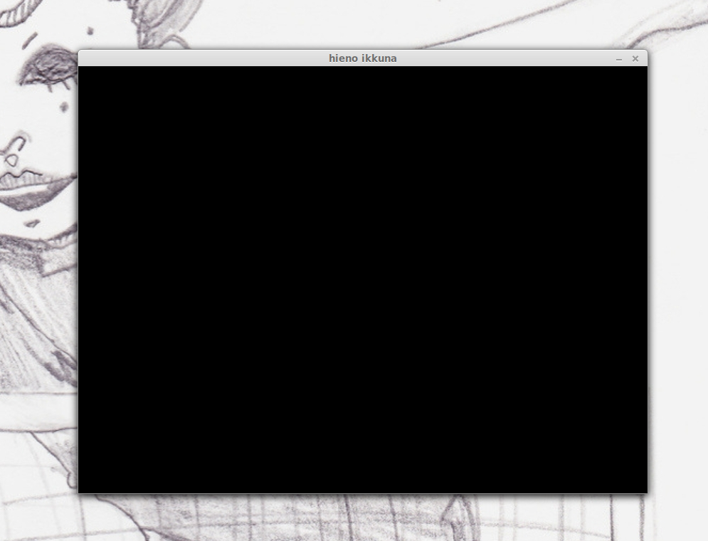

# Osa 1 - Ikkuna ja ympyrä - Tehtävät

## 1.
### a)
Tee uusi pythonkooditiedosto, jossa on otettu pyglet käyttöön.
### b)
Lisää ohjelmalle ikkuna muuttujaan _ikkuna_.
### c)
Laita ikkuna aukeamaan, kun ohjelman laittaa päälle.
### d)
Varmista, että ikkuna on täysin musta.

## 2.
Jatka ensimmäisen tehtävän ohjelmaa.
Muuta ikkunan kokoa niin, että ikkunan leveys on 100 ja korkeus 200.

## 3.
Jatka ensimmäisen tehtävän ohjelmaa.
### a)
Lisää ohjelmalle toinen ikkuna nimeltä _ikkuna2_.
### b)
Tee ikkuna2:sta leveydeltään 600 ja korkeudeltaan 600.


## 4. (haastavampi tehtävä)
Ikkunan ylälaidassa olevaa otsikkoa voi muuttaa lisäämällä ikkunaa luodessa leveyden ja korkeuden lisäksi tiedon ikkunan otsikosta. Esimerkiksi seuraava koodi luo ikkunan, jonka otsikko on _hieno ikkuna_.

```python3
pyglet.window.Window(width = 800, height = 600, caption = "hieno ikkuna")
```

Jatka ensimmäisen tehtävän ohjelmaa.
### a)
Muokkaa koodia niin, että pienemmän ikkunan otsikoksi tulee _pieni ikkuna_.
### b)
Muokkaa koodia niin, että isomman ikkunan otsikoksi tulee _iso ikkuna_.
