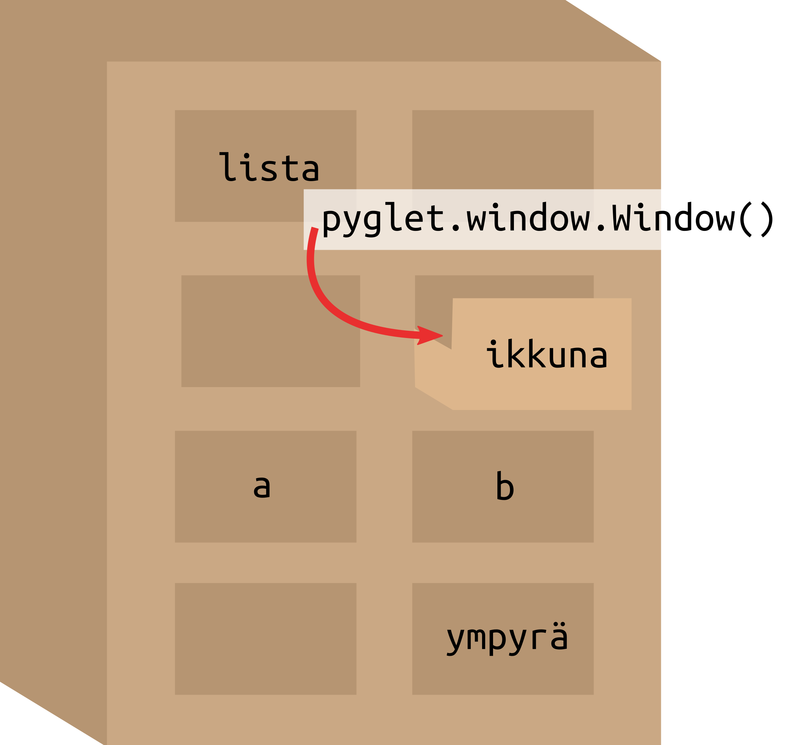
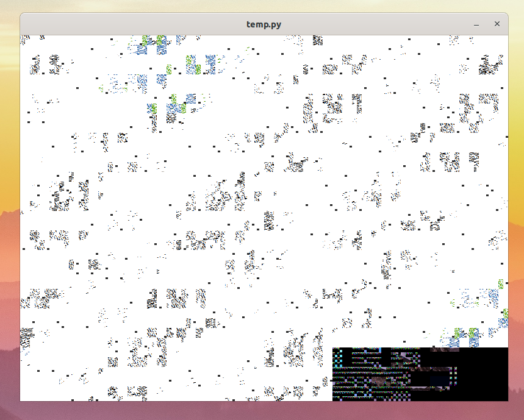

# Osa 1 - Ikkuna

## Mikä on ikkuna?

Ikkuna on se mitä yleensä pidetään ohjelmana. Oikeasti ikkuna on kuitenkin vain se osa ohjelmaa, jonka kanssa käyttäjä on tekemisissä. Ikkuna huolehtii muun muassa siitä, että käyttäjä näkee näytöllä jotain, sekä seuraa mitä näppäimiä käyttäjä painaa tai missä hiiren osoitin kulkee.

Tässä on esimerkki Miinaharava-pelin ikkunasta:


## Pygletin ikkuna

Jotta voimme saada jotain kivaa näkyviin, tarvitsemme ikkunan. Pygletistä löytyy tätä varten Window-niminen olio. Window on englantia ja tarkoittaa ikkunaa. Mitä sitten tarkoittaa, että ikkuna on olio? Ei sen kummempaa kuin että ikkuna on tavallaan jokin asia, jolla on erilaisia ominaisuuksia (kuten koko ja nimi) ja sille voi tehdä erilaisia juttuja (kuten siihen voi piirtää).

## Tehdään ohjelma jolla on ikkuna!

Tarvitsemme ikkunaa varten Pyglettiä joten lisätään se ohjelmaan kirjoittamalla kooditiedoston alkuun:

```Python3
import pyglet
``` 

Seuraavaksi luodaan ikkuna. Pygletissä ikkunan nimi on `Window`, joka on englantia ja tarkoittaa ikkunaa. Ikkunan voi luoda komennolla `pyglet.window.Window()`. 

Jotta voimme käyttää ikkunaa myöhemmin koodissa, tulee se laittaa johonkin talteen. Tätä varten tarvitsemme muuttujan. Muuttuja on kuin laatikko tietokoneen muistissa. Annamme laatikolle nimen ja laitamme ikkunan sinne talteen. Myöhemmin voimme kertoa ohjelmalle minkä nimisestä laatikosta ikkuna löytyy, ja voimme käyttää ikkunaamme uudestaan.



Sanotaan siis ohjelmalle, että muuttujassa nimeltä ikkuna on sisällä Pygletin  `Window`. Kerrotaan lisäksi Pygletin ikkunalle minkä kokoinen sen kuuluu olla. `width` tarkoittaa leveyttä ja `height` korkeutta. Tämän voi tehdä seuraavalla koodilla:

```Python3
ikkuna = pyglet.window.Window(width = 800, height = 600)
```

Nyt ohjelmalla on tiedossa ikkuna, mutta sillä ei tehdä vielä mitään. Haluamme että kun ohjelma laitetaan päälle, Pyglet lähtee käyntiin, jolloin ikkuna tulee näkyviin. Lisätään siis aivan ohjelman koodin loppuun:

```Python3
pyglet.app.run()
```
Nyt kun laitamme Python-ohjelmamme käytiin, näytölle ilmestyy ikkuna, jossa on sotkua. Näkymä on mahdollisesti jotain tämännäköistä:



Pygletin ikkuna on kuin liitutaulu. Siihen voi piirtää asioita tai taulun voi pyyhkiä tyhjäksi. 

Pygletin ikkunan saa pyyhittyä tyhjäksi sanomalla ikkunalle, että sen pitää pyyhkiytyä.Tätä varten lisätään koodiin **ennen** koodia `pyglet.app.run()` seuraavanlainen koodinpätkä:

```Python3
ikkuna.clear()
```

 Ikkuna on aikaisemmin tallennettu muuttujaan ikkuna. Voimme siis sanoa, että pitää tyhjentää se mitä on muuttujassa ikkuna. `clear` on englantia ja tarkoittaa tyhjentää.

Tässä vaiheessa koodin pitäisi siis näyttää tältä:

```Python3
import pyglet

ikkuna = pyglet.window.Window(width = 800, height = 600)

ikkuna.clear()

pyglet.app.run()
```

Nyt kun laitamme Python-ohjelman uudestaan päälle meille pitäisi ilmestyä tyhjä ruutu.


