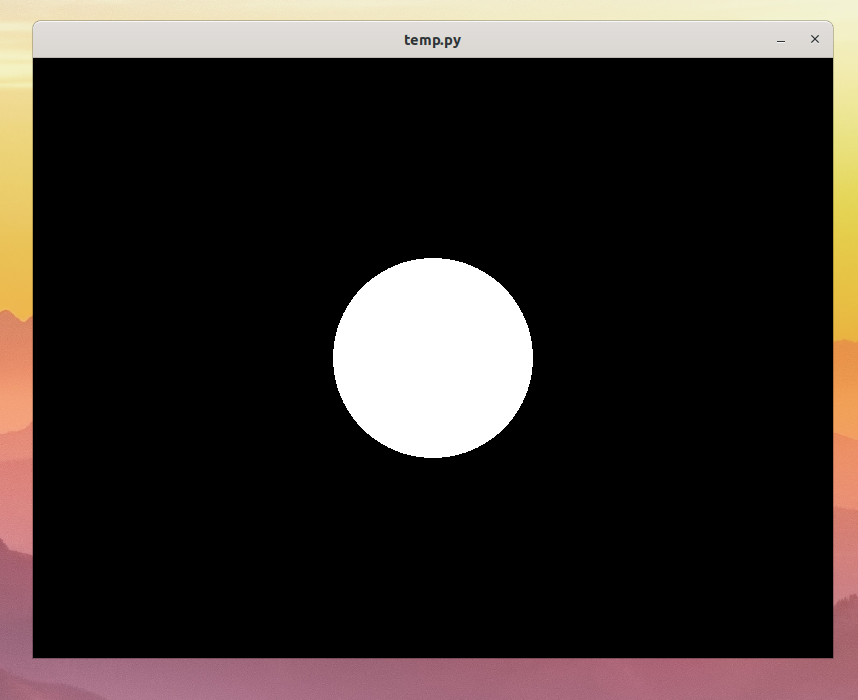

# Osa 1 - Ikkuna ja ympyrä

## Mikä on ikkuna?

Ikkuna on se mitä yleensä pidetään ohjelmana. Oikeasti ikkuna on kuitenkin vain se osa ohjelmaa, jonka kanssa käyttäjä on tekemisissä. Ikkuna huolehtii muun muassa siitä, että käyttäjä näkee näytöllä jotain, sekä seuraa mitä näppäimiä käyttäjä painaa tai missä hiiren osoitin kulkee.

Tässä on esimerkki Miinaharava-pelin ikkunasta:


## Pygletin ikkuna

Jotta voimme saada jotain kivaa näkyviin, tarvitsemme ikkunan. Pygletistä löytyy tätä varten Window-niminen olio. Window on englantia ja tarkoittaa ikkunaa. Mitä sitten tarkoittaa, että ikkuna on olio? Ei sen kummempaa kuin että ikkuna on tavallaan jokin asia, jolla on erilaisia ominaisuuksia (kuten koko ja nimi) ja sille voi tehdä erilaisia juttuja (kuten siihen voi piirtää).

## Tehdään ohjelma jolla on ikkuna!

Tarvitsemme ikkunaa varten Pyglettiä joten lisätään se ohjelmaan kirjoittamalla kooditiedoston alkuun:

```Python3
import pyglet
``` 

Seuraavaksi luodaan ikkuna. Sanotaan siis ohjelmalle, että jokin asia nimeltä ikkuna on Pygletin ikkuna eli `Window`. Lisäksi kerrotaan minkä kokoinen tämä ikkuna on. `width` tarkoittaa leveyttä ja `height` korkeutta.

```Python3
ikkuna = pyglet.window.Window(width = 800, height = 600)
```

Nyt ohjelmalla on tiedossa ikkuna, mutta sillä ei tehdä vielä mitään. Haluamme, että Pyglet lähtee käyntiin, kun ohjelma suoritetaan, niin että ikkuna tulee näkyviin. Lisätään siis aivan ohjelman koodin loppuu

```Python3
pyglet.app.run()
```
Nyt kun laitamme Python-ohjelmamme käytiin, näytölle ilmestyy ikkuna, jossa on sotkua. Näkymä on mahdollisesti jotain tämännäköistä:


Pygletin ikkuna on kuin liitutaulu. Siihen voi piirtää asioita tai taulun voi pyyhkiä tyhjäksi. 

Pygletin ikkunan saa pyyhittyä tyhjäksi sanomalla ikkunalle, että sen pitää pyyhkiytyä. Tätä varten lisätään koodiin **ennen** koodia `pyglet.app.run()` seuraavanlainen koodinpätkä:

```Python3
ikkuna.clear()
```

`clear` on englantia ja tarkoittaa tyhjentää.

Tässä vaiheessa koodin pitäisi siis näyttää tältä:

```Python3
import pyglet

ikkuna = pyglet.window.Window(width = 800, height = 600)

ikkuna.clear()

pyglet.app.run()
```

Nyt kun laitamme Python-ohjelman uudestaan päälle meille pitäisi ilmestyä tyhjä ruutu.


## Lisätään ikkunaan ympyrä

Pelkkä musta ikkuna on vähän tylsä. Lisätään siis ikkunaan ympyrä.
Pygletistä löytyy ympyröitä varten olio ympyrä eli `Circle`. Ei pohdita nyt sen enempää mikä ympyrä on, vaan voit kopioida alla olevan koodin, joka luo ympyrän nimeltä ympyrä.

```Python3
ympyrä = pyglet.shapes.Circle(x = 400, y = 300, radius = 100)
```

Laita koodi ikkunan luomisen jälkeen.

Jotta ympyrä tulisi näytölle, se pitää piirtää ruutuun erikseen. Sen saa aikaiseksi seuraavalla koodilla:

```Python3
@ikkuna.event
def on_draw():
    ympyrä.draw()
```

Pohditaan seuraavassa osassa tarkemmin mitä tämä koodi tekee. Nyt riittää, että se lisätään koodiin ennen koodien `ikkuna.clear()` ja `pyglet.app.run()` väliin.

Python-ohjelman pitäisi nyt siis kokonaisuudessaan näyttää tältä:
```Python3
import pyglet

ikkuna = pyglet.window.Window(width = 800, height = 600)
ympyrä = pyglet.shapes.Circle(x = 400, y = 300, radius = 100)

ikkuna.clear()

@ikkuna.event
def on_draw():
    ympyrä.draw()

pyglet.app.run()
```

Nyt kun laitamme ohjelman käyntiin, saamme seuraavanlaisen näkymän:

