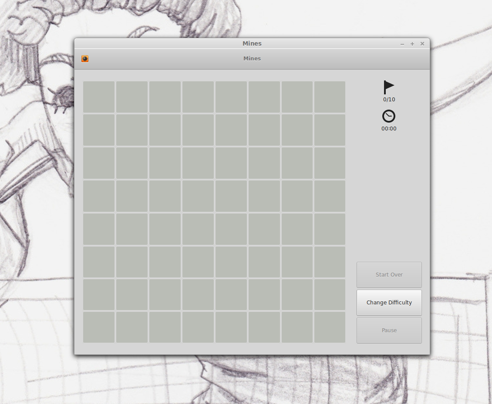
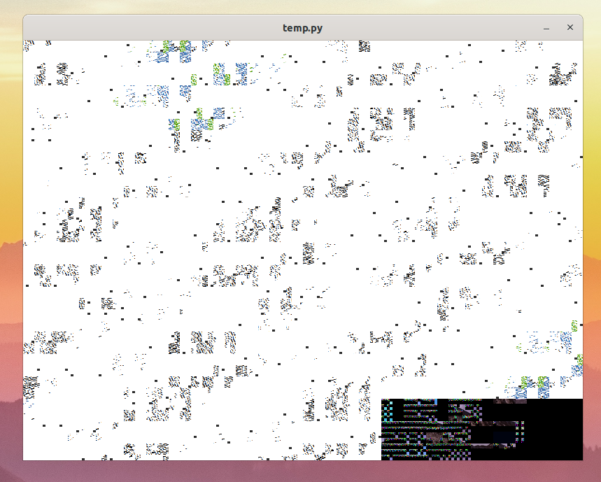

# Osa 1 - Ikkuna ja ympyrä

## Mikä on ikkuna

Ikkuna on se mitä yleensä pidetään ohjelmana. Oikeasti ikkuna on kuitenkin vain se osa ohjelmaa, jonka kanssa käyttäjä on tekemisissä. Ikkuna huolehtii muun muassa siitä, että käyttäjä näkee näytöllä jotain, sekä seuraa mitä näppäimiä käyttäjä painaa tai missä hiiren osoitin kulkee.

Tässä on esimerkki Miinaharava-pelin ikkunasta:


## Pygletin ikkuna

Jotta voimme saada jotain kivaa näkyviin, tarvitsemme ikkunan. Pygletistä löytyy tätä varten Window-niminen olio. Window on englantia ja tarkoittaa ikkunaa. Mitä sitten tarkoittaa, että ikkuna on olio? Ei sen kummempaa kuin että ikkuna on tavallaan jokin asia, jolla on erilaisia ominaisuuksia (kuten koko ja nimi) ja sille voi tehdä erilaisia juttuja (kuten siihen piirtää).

## Tehdään ohjelma jolla on ikkuna!

Tarvitsemme ikkunaa varten pyglettiä joten lisätään se ohjelmaan kirjoittamalla kooditiedoston alkuun:

```Python3
import pyglet

``` 

Seuraavaksi luodaan meille ikkuna. Sanotaan siis ohjelmalle, että jokin asia nimeltä ikkuna on Pygletin ikkuna (eli Window). Lisäksi kerrotaan minkä kokoinen tämä ikkuna on. `width` tarkoittaa leveyttä ja `height` korkeutta.

```Python3

ikkuna = pyglet.window.Window(width=800, height=600)

```

Nyt ohjelmalla on tiedossa ikkuna, mutta sillä ei tehdä vielä mitään. Haluamme, että Pyglet lähtee käyntiin, jolloin ikkuna tulee näkyviin. Lisätään siis aivan ohjelman koodin loppuu

```Python3
se osaa

pyglet.app.run()
```
Nyt kun laitamme Python-ohjelmamme käytiin, näytölle ilmestyy ikkuna, jossa on sotkua, mahdollisesti jotain tämännäköistä:



Pygletin ikkuna on kuin liitutaulu. Siihen voi piirtää asioita tai taulun voi pyyhkiä tyhjäksi. 

Pygletin ikkunan saa pyyhittyä tyhjäksi sanomalla ikkunalle, että sen pitää pyyhkiytyä. Tätä varten lisätään koodiin **ennen** koodia ```pyglet.app.run()``` seuraavanlainen koodinpätkä:

```Python3
ikkuna.clear()
```

Clear on englantia ja tarkoittaa tyhjentää.

Nyt kun laitamme Python-ohjelman uudestaan päälle meille pitäisi ilmestyä tyhjä ruutu.

