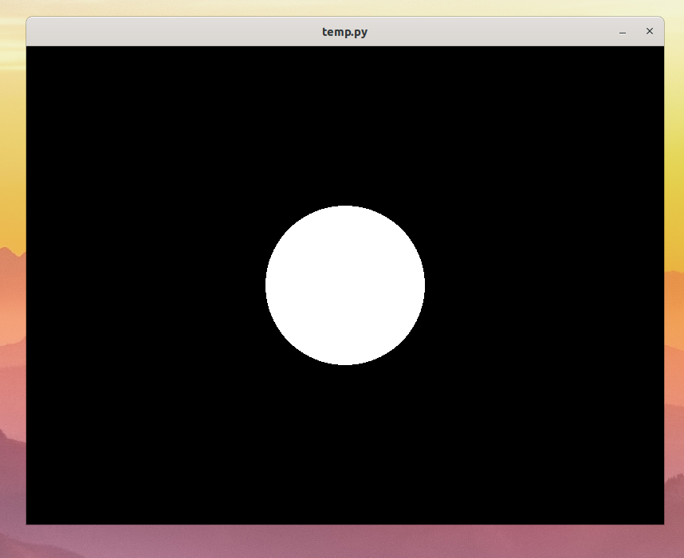
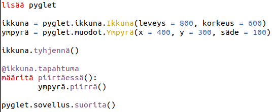

# Osa 2 - Ympyrä

## Lisätään ikkunaan ympyrä

Edellisessä osassa teimme ohjelman, jolla on ikkuna. Pelkkä musta ikkuna on vähän tylsä. Lisätään siis ikkunaan ympyrä.
Pygletistä löytyy ympyröitä varten olio ympyrä eli `Circle`. Ei pohdita nyt sen enempää mikä ympyrä on, vaan voit kopioida alla olevan koodin, joka luo ympyrän ja laittaa sen säilöön muuttujaan nimeltä ympyrä.

```Python3
ympyrä = pyglet.shapes.Circle(x = 400, y = 300, radius = 100)
```

Laita koodi ikkunan luomisen jälkeen.

Jotta ympyrä tulisi näytölle, se pitää piirtää ikkunaan. Sen saa aikaiseksi seuraavalla koodilla:

```Python3
@ikkuna.event
def on_draw():
    ympyrä.draw()
```

Pohditaan seuraavassa osassa tarkemmin mitä tämä koodi tekee. Nyt riittää, että se lisätään ohjelmaan koodien `ikkuna.clear()` ja `pyglet.app.run()` väliin.

Python-ohjelman pitäisi nyt siis kokonaisuudessaan näyttää tältä:
```Python3
import pyglet

ikkuna = pyglet.window.Window(width = 800, height = 600)
ympyrä = pyglet.shapes.Circle(x = 400, y = 300, radius = 100)

ikkuna.clear()

@ikkuna.event
def on_draw():
    ympyrä.draw()

pyglet.app.run()
```

Nyt kun laitamme ohjelman käyntiin, saamme seuraavanlaisen näkymän:



## Koodi suomeksi

Pythonissa ja pygletissä lähes kaikki komennot ovat englanniksi. Tässä on käännös miltä ohjelmamme näyttäisi jos Python ja Pyglet olisivat suomenkielisiä.


