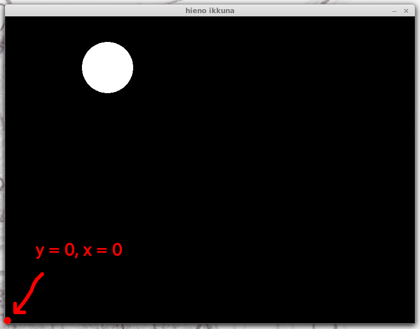
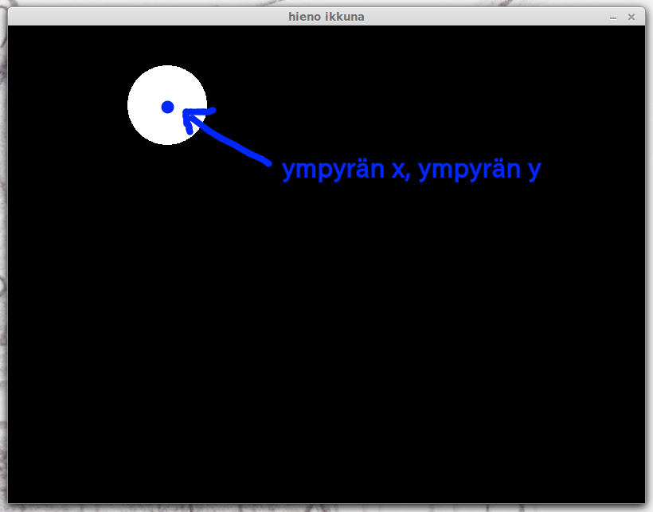

# Osa 2 - Ympyrä - Tehtävät

1. 
Luo uusi python-ohjelma, jolla on ikkuna (leveys 800, korkeus 600) ja joka avautuu mustana, kun ohjelman laittaa käyntiin.

---

2. 
Jatka edellisen tehtävän ohjelmaa.

a) 
Lisää ohjelmaan koodi, joka tallettaa muuttujaan nimeltä _ympyrä_ pygletin ympyrän.

b)
Laita ympyrä ilmestymään ikkunaan.

---

3. 
Ympyrämuodon saa pygletillä komennolla `pyglet.shapes.Circle(x = 400, y = 300, radius = 100)`.

Jatka ensimmäisen tehtävän ohjelmaa.

a)
Muuta ohjelmassa ympyrän koodia niin, että `radius = 100` tilalla lukeekin `radius = 50`. Mitä tästä seuraa?

b)
Muuta sitten ohjelmassa ympyrän koodia niin, että `x = 400` tilalla lukeekin `x = 200`. Mitä tästä seuraa?

c)
Muuta vielä ympyrän koodia niin, että `y = 300` tilalla lukeekin `y = 500`. Mitä tapahtui?

---

4. (Haastavampi tehtävä)

Ympyrä on olio, jonka ikkuna piirtää itseensä.

Olioilla on paljon tietoa itsestään. Ympyrä tietää esimerkiksi minkä kokoinen se on, missä kohtaa sen pitäisi ikkunassa sijaita tai vaikkapa minkä värinen se on.

Näitä tietoja voi kertoa ympyrälle kun sen luo, tai niitä voi muuttaa ohjelmassa myöhemmin. Esimerkiksi kun hahmo liikkuu, sen sijainti muuttuu.

Ikkunassa asioiden sijainnit kerrotaan koordinaateilla. Ikkuna on suuri ruudukko ja ympyrä kertoo ikkunalle missä ruudussa se sijaitsee. Yksi ruutu ikkunassa vastaa yhtä pikseliä tietokoneen näytöllä.

Ikkunan leveys kertoo kuinka monta ruutua ikkuna on leveä ja korkeus montako ruutua ikkuna on korkea.

Ympyrällä taas ominaisuus x kertoo monennessako ruudussa ympyrä on sivusuunnassa laskettuna ja y kertoo missä ruudussa se on pystysuunnassa laskettuna.

Ruutujen laskeminen alkaa vasemmasta alakulmasta.

Ympyrän sijainti on sen keskipisteen sijainti ruudukossa.

Jatka edellistä tehtävää.

a)
Laita ympyrä sijaitsemaan aivan vasemmassa alakulmassa.

b)
Laita ympyrä ruudun keskelle.

c)
Laita ympyrä oikean laidan keskelle.

d)
Laita ympyrä vasempaan alakulmaan niin, että se on kuitenkin kokonaan näkyvissä.

---

[Seuraava osa](../osa3/ohjeet.md)