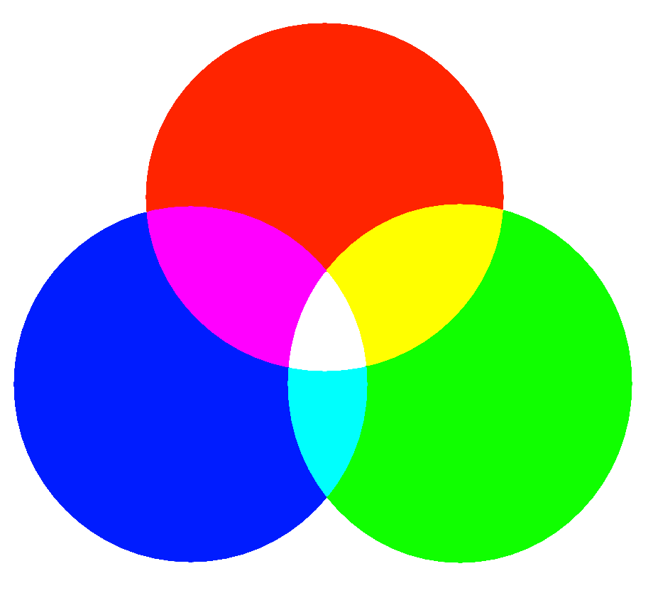

# Osa 3 - Ikkunatapahtumat - Tehtävät

1.

a) Luo uusi python-ohjelma, jolla on ikkuna (leveys 800, korkeus 600) ja joka avautuu mustana.

b) Lisää ikkunaan ympyrä.

---

2. 

Jatka edellisen tehtävän ohjelmaa.

a) Lisää ikkunatapahtuma, joka tarkistaa painetaanko jotain nappia.

b) Muokkaa koodia niin, että napinpainallus muuttaa ympyrän värin punaiseksi.

---

3. 

Jatka edellisen tehtävän ohjelmaa.

a) Lisää ikkunatapahtuma, joka tarkistaa loppuuko jonkin napin painaminen.

b) Ohjelmoi napin väri muuttumaan valkoiseksi, kun napin painaminen loppuu.

---

4. 

Jatka edellisen tehtävän ohjelmaa.

Tällä hetkellä koodissa muutetaan ympyrä punaiseksi komennolla `ympyrä.color = 255, 0, 0`. 

a) Muokkaa koodia niin, että nappia painaessa tapahtuukin komento `ympyrä.color = 0, 255, 0`. Mitä tapahtui?

b) Muokkaa koodia niin, että ympyrän väriksi tulee `0, 0, 255`. Minkä värinen ympyrä nyt on?

---

5. (Haastavampi tehtävä)

Olet ehkä oppinut, että päävärit ovat punainen, sininen ja keltainen, ja että muut värit saa näitä värejä sekoittamalla. Lisäksi mitä useampaa väriä sekoittaa, sitä tummempia niistä tulee.

Tietokoneella kuitenkin päävärit ovat punainen, vihreä ja sininen, ja kaikki muut värit saa näitä värejä sekoittamalla. Tietokoneen näyttö koostuu pienen pienistä valoista nimeltä pikseli. Tietokoneen näytöllä näkyvät värit ovatkin erilaisia yhdistelmiä punaista, sinistä ja vihreää valoa. Mitä enemmän värejä sekoittaa, sitä vaaleammaksi väri tulee. Siksi tietokoneen värejä kutsutaan valoväreiksi.

a) Ympyrälle annetaan sen väri muodossa `numero, numero, numero`. Selvitä mikä numeroista kertoo punaisen valon, mikä vihreän valon ja mikä sinisen valon määrän.

b) `255, 0, 0` on kirkkain mahdollinen punainen. 255 on isoin määrä paljonko jonkin väristä valoa voi olla. 0 taas taas tarkoittaa, että tietynväristä valoa ei ole ollenkaan. Selvitä millaisella komennolla voidaan tehdä ympyrästä kirkkaanpunaisen sijaan tummanpunainen.

c) Muokkaa koodia niin, että ympyrä ei muutu nappia painamalla punaiseksi vaan keltaiseksi.

d) Muokkaa koodia niin, että ympyrä on aluksi punainen ja palaa napin painamisen loputtua punaiseksi.

---

[Seuraava osa](../osa4/ohjeet.md)