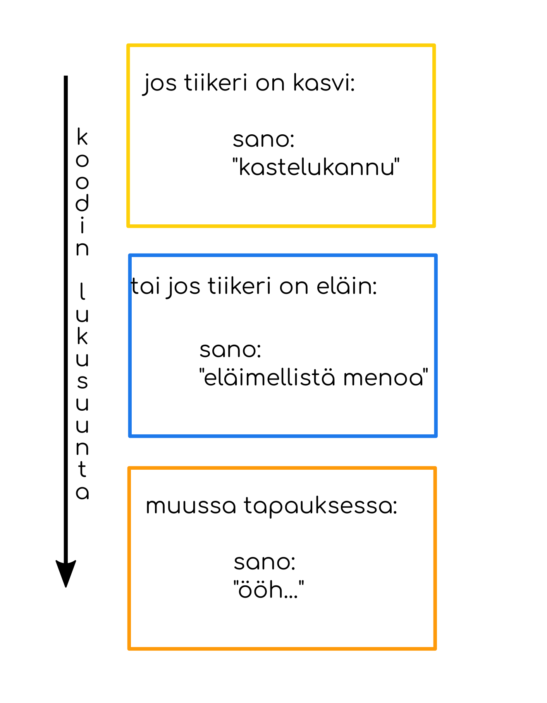

# Osa 4 - Ehtolauseet

Edellisessä osassa teimme ohjelman, jossa pallon väri vaihtui näppäintä painamalla. Ohjelmaa ei kuitenkaan kiinnostanut ollenkaan mitä näppäintä painettiin. Jatketaan ohjelmointia nyt niin, että ympyrä vaihtaa väriä ainoastaan, kun painetaan näppäintä _P_.

Näppäinten painamista tarkistava ikkunatapahtuma `on_key_press` näyttää tällä hetkellä koodissa suunnilleen tältä:

```Python3
@ikkuna.event
def on_key_press(merkki, muuntaja):
    ympyrä.color = 255, 0, 0
```

Suluissa olevat `merkki` ja `muuntaja` ovat ikkunatapahtuman parametrejä. Ne ovat ikkunatapahtuman omia muuttujia, jotka kertovat lisätietoa näppäimen painalluksesta. Muuttujaan `merkki` on tallennettu, mitä näppäintä on painettu. Muuttujaan `muuntaja` on tallennettu onko samaan aikaan painettu jotain muuntavaa näppäintä kuten Shift tai Ctrl.

Haluamme nyt muokata koodiamme niin, että ympyrän väriä muutetaan **vain** jos painettu näppäin, eli `merkki`, on P.

Kun halutaan tarkistaa ovatko jotkin kaksi asiaa sama asia, pythonissa käytetään kahta yhtäsuuruusmerkkiä. Pygletissä taas näppäimistön merkki P on `pyglet.window.key.P`. Siis voimme tarkistaa onko painettu näppäin P seuraavasti:

```Python3
merkki == pyglet.window.key.P
```

## if-komento

Pelkällä testaamisella emme kuitenkaan tee mitään. Tarvitsemme _ehtolauseen_. Haluamme sanoa ohjelmalle, että **jos** `merkki == pyglet.window.key.P`, niin ympyrän väriksi vaihtuu punainen. Poista koodistasi `ympyrä.color = 255, 0, 0` ja korvaa se seuraavalla ehtolauseella:

```Python3
if merkki == pyglet.window.key.P:
    ympyrä.color = 255, 0, 0
```
> Huom! Muista sisennys rivillä `ympyrä.color = 255, 0, 0`, niin että se on ehtolauseen sisällä.

`if` on englantia ja tarkoittaa _jos_. Sitä kutsutaan ehtolauseeksi, koska sille annetaan ehto, kuten `merkki == pyglet.window.key.P`. Jos ehto on totta, niin `if`:n sisällä olevat asiat toteutuvat. Jos ehto taas ei ole totta, esimerkiksi painettu näppäin on A eikä P, niin ehtolauseen sisällä olevat komennot eivät toteudu.

Nyt ympyrän pitäisi muuttua punaiseksi ainoastaan, jos painetaan näppäintä P.

## Erilaisia ehtolauseita

Ehtolauseita on kolmenlaisia: `if`, `elif` ja `else`. Suomeksi ne tarkoittavat kutakuinkin `jos`, `tai jos` ja `muussa tapauksessa`.

Tutkin hiukan lähemmin miten nämä ehtolauseet toimivat:


Tässä on leikkikoodi, jossa ensin tarkistetaan onko tiikeri eläin ja sitten tarkistetaan onko tiikeri oranssi. Ohjelma tarkistaa ensin ensimmäisen jos-lauseen ja sen ollessa totta, se sanoo "eläimellistä touhua". Sitten tietokone etenee seuraavaan jos-lauseeseen, jonka ollessa totta, ohjelma sanoo "appelsiinkin kaltainen".


Tässä koodissa on tärkeää huomata, että toinen ehtolause ei ole jos-lause vaan tai jos -lause. Tai jos -lause käsitellään vain jos sitä edeltävä jos-lause ja "tai jos"-lauseet eivät ole totta. Koska ensimmäinen jos-lause on totta, tietokone hyppää tai jos -lauseen yli kokonaan ja sanoo ainoastaan "eläimellistä touhua".


Tässä koodissa on muussa tapauksessa -lause. Muussa tapauksessa -lause käsitellään vain jos sitä edeltävä jos-lause ja "tai jos"-lauseet eivät ole totta.
Tietokone tarkistaa ensin onko tiikeri kasvi. Koska tämä ei ole totta se testaa seuraavaksi, että olisiko tiikeri sittenkin huonekalu. Koska tämäkään ei ole totta, tietokone lopulta päätyy muussa tapauksessa -lauseeseen ja sanoo siis loppujen lopuksi ainoastaan "ööh".



Tämä koodi on hyvin samanlainen kuin edellinen, mutta nyt toisena tuleva tai jos -lause onkin totta, joten tietokone sanoo sen kohdalla "eläimellistä menoa" ja sen jälkeen hyppää muussa tapauksessa -lauseen yli.


## Ohjelma tähän mennessä

Tähän mennessä koko ohjelma näyttää siis seuraavalta:

```Python3
import pyglet

ikkuna.pyglet.window.Window(width = 800, height = 600)
ympyrä = pyglet.shapes.Circle(x = 400, y = 300, radius = 100)

@ikkuna.event
def on_draw():
	ikkuna.clear()
	ympyrä.draw()

@ikkuna.event
def on_key_press(merkki, muuntaja):
	if merkki == pyglet.window.key.P:
        ympyrä.color = 255, 0, 0

@ikkuna.event
def on_key_release(merkki, muuntaja):
	ympyrä.color = 255, 255, 255

pyglet.app.run()
```
