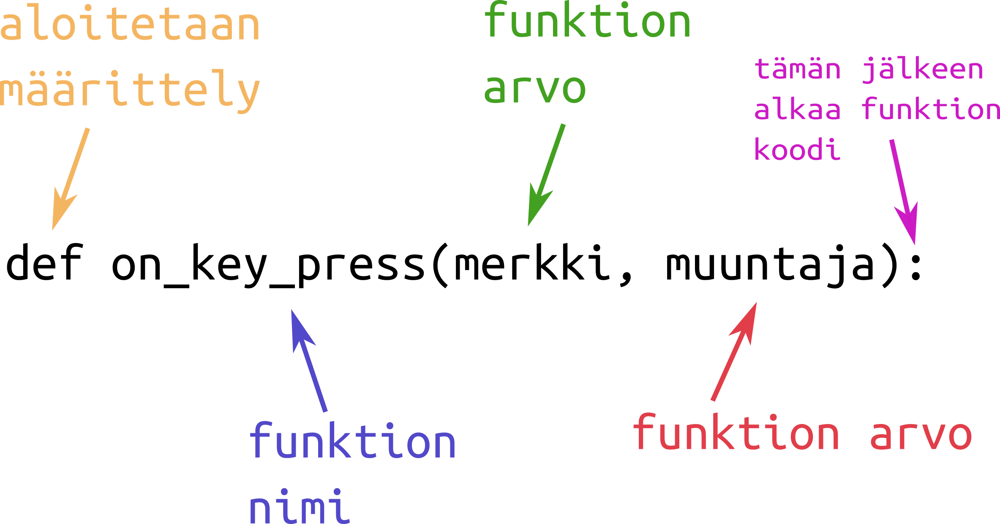

# Osa 5 - Aikataulutus ja funktiot

Tähän mennessä ohjelmamme tekee asioita vain silloin, kun pelaaja painaa nappia. Peleissä kuitenkin tapahtuu usein asioita myös pelaajan tekemättä mitään, esimerkiksi pelaajaa saattaa jahdata vihollinen tai pelikentälle ilmestyy vähän väliä keräiltäviä aarteita.

## Pygletin kello

Kun jokin tapahtuu omia aikojaan, tarvitsee ohjelman tietää milloin se tapahtuu. Tätä varten pygletistä löytyy `clock`, eli kello. Kellon kaikki komennot alkavat `pyglet.clock`.

Kelloa voi käyttää yleisesti ottaen kolmella tavalla:
1. Kellolla voi aikatauluttaa, että jotain tehdään koko ajan.
2. Kellolla voi aikatauluttaa, että jotain tehdään tietyn ajan välein, esimerkiksi kerran sekunnissa.
3. Kellolla voi aikatauluttaa, että jotain tehdään vain kerran tietyn ajan kuluttua, esimerkiksi kolmen sekunnin päästä.

Näitä kellon käyttötapoja vastaavat komennot ovat:
1. `pyglet.clock.schedule()`, mikä on englantia ja tarkoittaa _pyglet.kello.aikatauluta()_
2. `pyglet.clock.schedule_interval()`, mikä on suomeksi *pyglet.kello.aikatauluta_aikaväli()*
3. `pyglet.clock.schedule_once()`, mikä on suomeksi *pyglet.kello.aikatauluta_kerran()*

Komennon lopussa oleviin sulkuihin merkitään mitä aikataulutetaan. Puhutaankin siis seuraavaksi vielä nopeasti mitä nämä aikataulutettavat asiat ovat.

## Funktio

Funktiot saattavat olla matematiikan tunnilta tuttuja, mutta ohjelmoinnista funktiot ovat hieman erilaisia. Yksinkertaisesti sanottuna funktio on aliohjelma, eli pieni ohjelma, jota voi käyttää jonkin muun isomman ohjelman sisällä. Olemme tähän mennessä itse asiassa jo käyttäneet funktioita: ikkunatapahtumat nimittäin määritellään funktioilla! Pääohjelmalle on itse peli, ja se mitä näppäintä painaessa tehdään on oma pienempi ohjelmansa, jota pelimme käyttää.

Funktion kirjoittaminen aloitetaa sanalla `def`. Se on lyhenne englannin sanasta _define_ eli _määrittele_. Sen jälkeen tulee funktion nimi ja sitten sulkuihin mitä arvoja funktiossa halutaan voida käyttää.



Kaksoispisteen jälkeen kirjoitetaan mitä funktio tekee. Kaiken funktion koodin tulee olla sisennettyä eli:

```Python3
def funktio():
    funktion sisältö tulee kirjoittaa näin
    myös uudessa rivissä on sisennys
```
**Tämä on oikein 🠕**

**Tämä on väärin 🠗**
```Python3
def funktio():
funktion sisältöä ei voi kirjoittaa näin
```


Funktiot ovat ohjelmoinnin monikäyttöisimpiä työkaluja ja niitä voi hyödyntää paljon muussakin kuin ikkunatapahtumissa ja aikatauluttamisessa. Emme kuitenkaan tutustu funktioiden muihin käyttötarkoituksiin nyt.

## Tehdään aikatauluttamalla diskopallo

Nyt voimme jatkaa viimekerran ohjelmaa. Ohjelmoidaan niin, että pallo vaihtaa yhden sekunnin välein väriään seuraavan kuvan mukaisesti, eli punaisesta vihreäksi, vihreästä siniseksi ja sinisestä takaisin vihreäksi.


Aloitetaan määrittelemällä funktio, joka muuttaa pallon väriä. Annetaan funktion nimeksi vaikkapa diskopallo. Aikataulutettavat funktiot tarvitsevat arvokseen ajan jolloin funktiota on viimeksi kutsuttu (käytetty). Tätä arvoa kutsutaan _delta-ajaksi_ ja siksi sitä usein merkitään _dt_.

Aloitetaan siis funktion kirjoittaminen näin: `def diskopallo(dt):`

Seuraavaksi mietitään mitä funktion pitää tehdä. Jos funktion väri on punainen, pitää väriksi vaihtaa vihreä. Toisaalta jos väri on vihreä, pitää väristä tulla sininen tai jos väri on sininen, tulee väriksi vaihtua taas punainen. Tarvitaan siis ehtolauseita.

Lisäksi ohjelmassamme ympyrä voi olla myös valkoinen. Ohjelmoidaan siis, että jos väri on jotain muuta kuin punainen, vihreä tai sininen, niin väriksi vaihdetaan aina punainen. 

Kokonaisuudessaan funktio näyttäisi siis tältä:

```Python3
def diskopallo(dt):
    if ympyrä.color == (255, 0, 0):
        ympyrä.color = 0, 255, 0
    elif ympyrä.color == (0, 255, 0):
        ympyrä.color = 0, 0, 255
    elif ympyrä.color == (0, 0, 255):
        ympyrä.color = 255, 0, 0
    else:
        ympyrä.color = 0, 255, 0
```

> Huom! Ehtolauseet menevät värien pilkuista sekaisin, joten värit on laitettu sulkuihin ehtolauseissa.

Nyt kun meillä on funktio mitä aikatauluttaa, aikataulutetaan se!

Koska haluamme, että funktio tapahtuu kerran sekunnissa, käytämme komentoa `pyglet.clock.schedule_interval()`. Merkitään sulkuihin aikataulutettavan funktion nimi, pilkku ja pilkun jälkeen kuinka monen sekunnin välein haluamme, että funktio tehdään. Koko komento on siis:

```Python3
pyglet.clock.schedule_interval(diskopallo, 1)
```

Lisätään komento ohjelmaamme funktion jälkeen, mutta ennen koodia `pyglet.app.run()`.

Nyt meillä on diskopallo!

## Koodi tähän mennessä

```Python3
import pyglet

ikkuna = pyglet.window.Window(width = 800, height = 600)
ympyrä = pyglet.shapes.Circle(x = 400, y = 300, radius = 100, color = (255, 0, 0))

@ikkuna.event
def on_draw():
	ikkuna.clear()
	ympyrä.draw()

@ikkuna.event
def on_key_press(merkki, muuntaja):
    if merkki == pyglet.window.key.P:
        ympyrä.color = 255, 0, 0
    else:
        ympyrä.color = 0, 0, 255

@ikkuna.event
def on_key_release(merkki, muuntaja):
	ympyrä.color = 255, 255, 255

def diskopallo(dt):
    if ympyrä.color == (255, 0, 0):
        ympyrä.color = 0, 255, 0
    elif ympyrä.color == (0, 255, 0):
        ympyrä.color = 0, 0, 255
    elif ympyrä.color == (0, 0, 255):
        ympyrä.color = 255, 0, 0 
    else:
        ympyrä.color = 255, 0, 0

pyglet.clock.schedule_interval(diskopallo, 1)

pyglet.app.run()
```