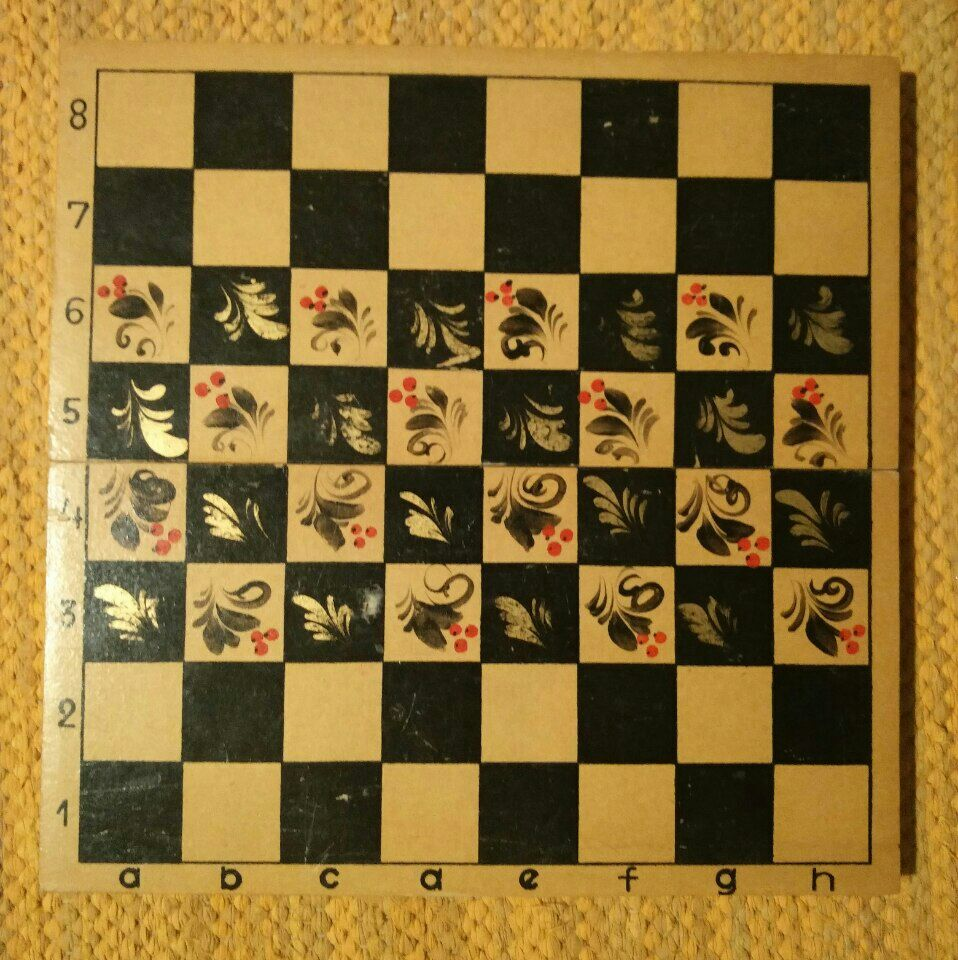
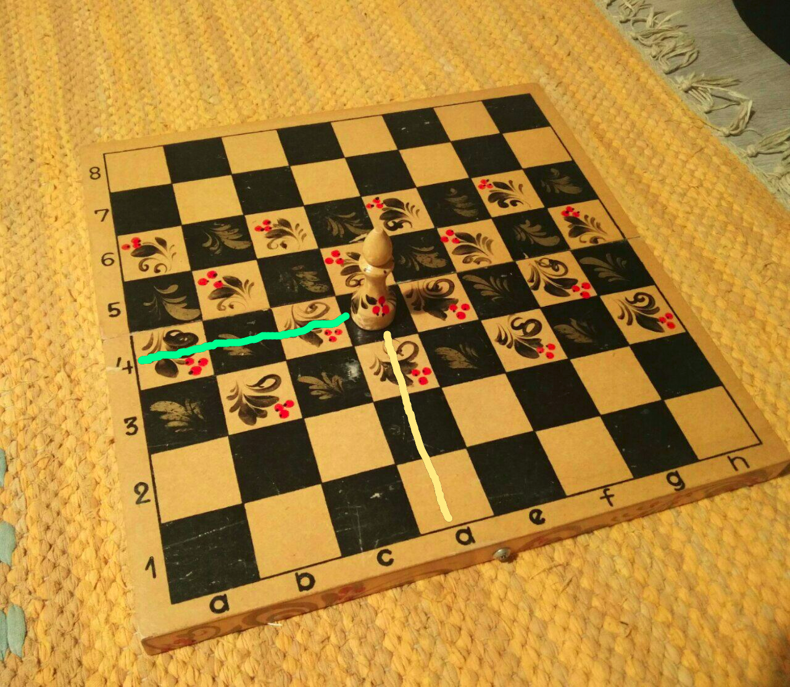
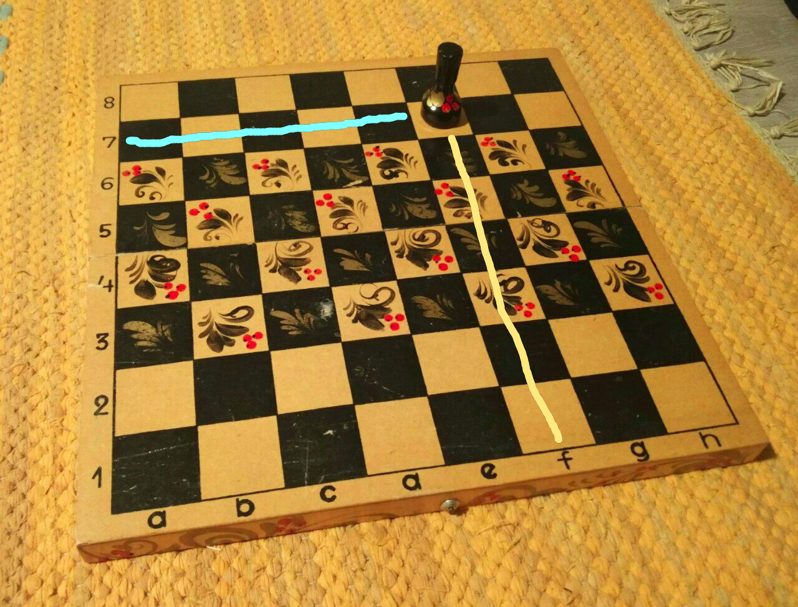
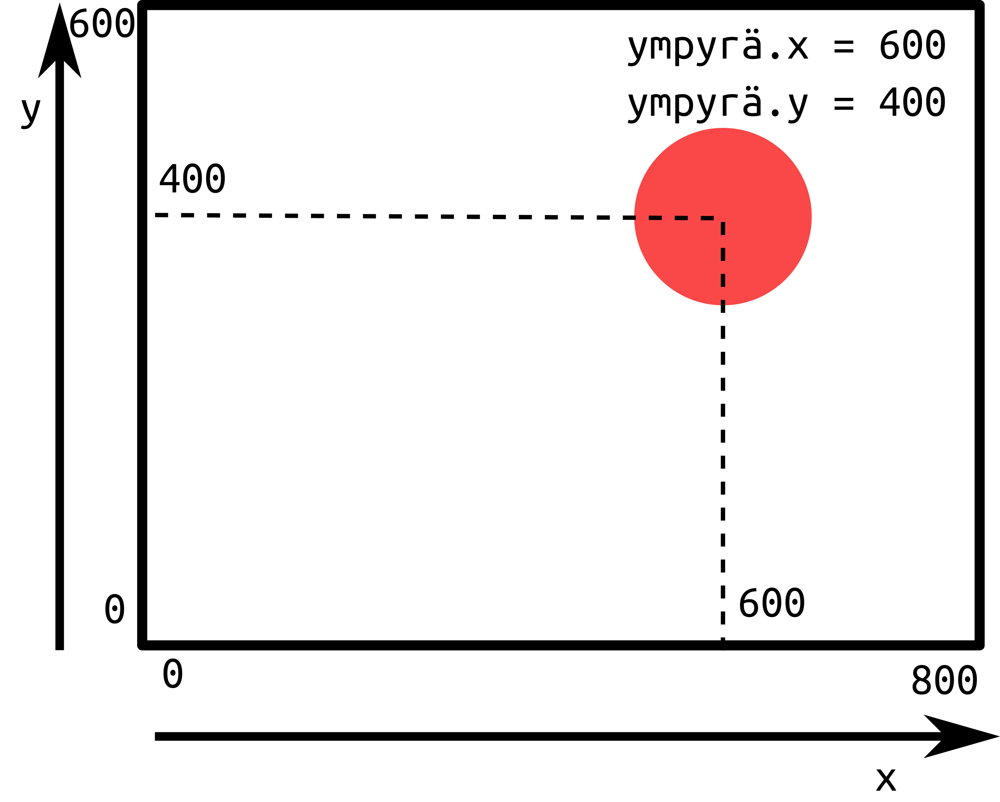

# Osa 6 - Koordinaatit

Nyt on hyvä aika pohtia hiukan syvällisemmin erästä pelikoodauksen kannalta erittäin tärkeää asiaa. Ikkunassamme olevilla hahmoilla, kuten ympyrällämme, on sijainti. Jos haluamme saada ympyrän ikkunassamme tiettyyn paikkaan, tai muuttamaan sijaintiaan (eli liikkumaan) meidän pitää ymmärtää mikä sijainnin kertoo ja miten sitä voi muuttaa.

Pygletissä hahmojen sijainnit ikkunassa kerrotaan koordinaattien avulla. Jokaisella hahmolla on tiedossaan omat koordinaattinsa, joiden avulla ikkuna piirtää ne oikeaan paikkaan. Puhutaankin seuraavaksi siitä mitä koordinaatit ovat.

## Shakkilaudan koordinaatit

Olet ehkä nähnyt joskus shakkilaudan. Tässä kuitenkin muistinvirkistykseksi kuva:



Shakkilaudan kahdella sivulla on merkitty jokaisen ruudun viereen joko kirjain tai numero. Nyt jokaisen nappulan sijainti voidaan ilmaista sen avulla, että minkä numeron ja kirjaimen kanssa se on samalla rivillä.

Esimerkiksi tässä kuvassa laudalla on lähetti. 

Lähetti on ruudussa joka on samalla rivillä kuin kirjain d ja numero 4. Siis sen koordinaatit ovat d4.




Tässä kuvassa taas on torni. Torni on samalla rivillä kuin kirjain f ja numero 7. Siis sen koordinaatit ovat f7.



## Pygletin ikkunan koordinaatit

Pygletin ikkunassa koordinaatit toimivat käytännössä samalla tavalla, mutta kirjainten ja numeroiden sijaan käytetään pelkkiä kirjaimia.

X-koordinaatti kertoo vaakasuuntaisen sijainnin, eli kuinka oikealla tai vasemmalla hahmo on. Y-koordinaatti kertoo kuinka ylhäällä tai alhaalla hahmo on.

Lisäksi pygletissä mahdollisia ruutuja joissa sijaita on yleensä paljon enemmän. Jokainen tietokoneen näytöllä oleva pikseli on nimittäin yksi sellainen! Ikkunan koko vaikuttaa siihen montako pikseliä ikkunassa on. Tähän mennessä olemme luoneet ikkunan komennolla `pyglet.window.Window(width = 800, height = 600)`. Komennossa `width` tarkoittaa leveyttä ja kertoo siis kuinka monta pikseliruutua ikkuna on leveä. Vastaavasti `height` tarkoittaa korkeutta ja kertoo montako pikseliä ikkuna on korkea.

Pygletin ikkunassa aivan vasemmassa alareunassa x ja y ovat 0 ja ne kasvavat ylöspäin ja oikealle.



Hahmot eivät yleensä ole yhden pikselin kokoisia, joten niiden sijainti kerrotaan niiden keskipisteen avulla.

## Ympyrän koordinaatit

Tähän asti ohjelmoimallamme ympyrällä on siis koordinaatit, jotka kertovat sen sijainnin ikkunassa. X-koordinaatti on tallennettu muuttujaan `ympyrä.x` ja y-koordinaatti muuttujaan `ympyrä.y`. Näiden muuttujien arvoja vaihtamalla saadaan siis myös sijainti muuttumaan!

## Ympyrän kordinaattien muuttaminen

Yleensä haluamme tehdä hahmoillemme jompaa kumpaa seuraavista:

1. Haluamme siirtää sen tiettyyn paikkaan. Esimerkiksi jos haluamme, että pelin alussa pelaaja aloittaa aina pelikentän keskeltä.

2. Haluamme sen liikkuvan johonkin suuntaan, esimerkiksi nuolta vasemmalle painaessa 20 pikseliä vasemmalle.

Ensimmäisen toteuttaminen on helppoa. Voimme suoraan sanoa hahmolle minne mennä:

```Python3
ympyrä.x = 400
ympyrä.y = 300
```

Sen sijaan hahmon liikkuminen vasemmalle 20 pikseliä on hiukan vaikeampaa.

Jos hahmo liikkuu vasemmalle, sen x-koordinaatti pienenee. Siis 20 pikseliä vasemmalle liikuttaessa `uusi x-koordinaatti = nykyinen x-koordinaatti - 20`. Tämän voi ohjelmoida seuraavalla tavalla:

```Python3
ympyrä.x = ympyrä.x - 20
```

Tai sen voi kirjoittaa lyhyemmin:

```Python3
ympyrä.x -= 20
```

> Huom! Yhtäsuuruusmerkin edessä on miinus.

---

Tässä osassa käsittelimme vain koordinaattien teoriaan mutta seuraavassa osassa laitetaan ympyrämme liikkeelle!

[Seuraava osa](../osa7/ohjeet.md)