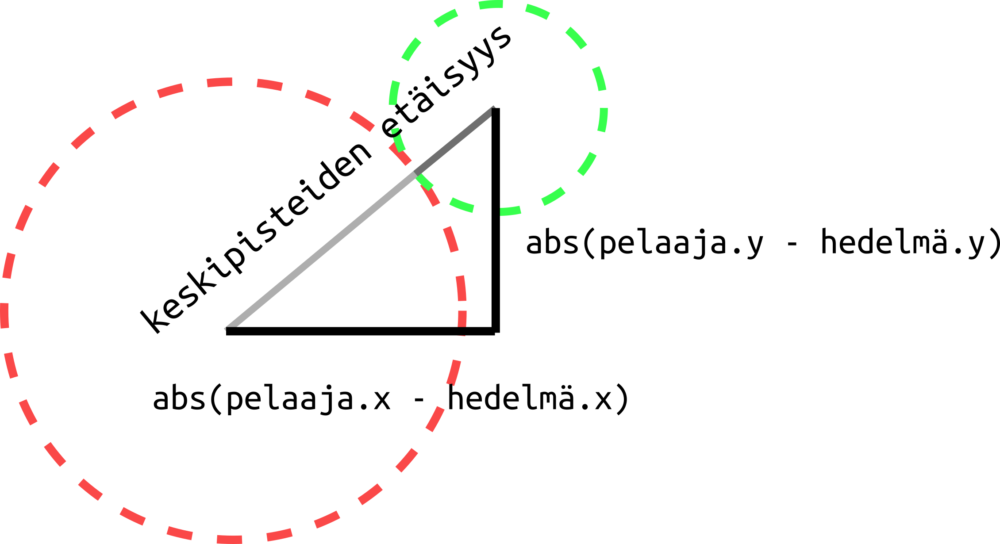

# Keräilypeli

Keräilypelissä kuljetaan ympäri pelikenttää ja keräillään asioita. Asioiden keräämisestä saa pisteitä. Lisäksi kentällä pelaajaa jahtaa pahis, jota kuuluu väistellä. Jos pahis saa pelaajan kiinni, peli päättyy.

## Pelin tiedostorakenne

Viime osassa käsittelimme moduuleja ja nyt kun alamme oikeasti ohjelmoida peliä, on hirveän hyödyllistä, että voimme jakaa koodin useaan eri tiedostoon. Koodin voi tietysti jakaa todella monella eri tavalla, mutta jotkin tavat ovat toisia kätevämpiä. Tässä ohjeessa koodi on jaettu kolmeen tiedostoon seuraavalla tavalla.


## Aloitetaan!

Luodaan ensin kansio mihin tulemme luomaan kaikki tiedostot koodia varten. Nimeä kansio `keräilypeli`.

Luodaan kansioon seuraavaksi päätiedosto, jonka käynnistämällä peli lähtee käyntiin. Annetaan sen nimeksi `keräilypeli.py`.

Avataan tämä tiedosto ja luodaan peliä varten ikkuna. Muista lisätä ensin pyglet! Laitetaan vielä ikkuna aukeamaan.

Tiedosto näyttää nyt siis jotakuinkin tältä:

```Python3
import pyglet

ikkuna = pyglet.window.Window(width = 800, height = 600, caption = 'Keräilypeli')

pyglet.app.run()
```

Kaikki ikkunatapahtumat tullaa kirjoittamaan tähän tiedostoon.

## Luodaan pelaajahahmo

Luodaan seuraavaksi tiedosto, missä luomme ja mihin säilömme kaiken pelin datan. Lisätään kansioon uusi tiedosto nimeltä `data.py`. Avaa tiedosto.

Tässäkin tiedostossa pitää muistaa ensin ottaa pyglet käyttöön. Kannattaa myös tallentaa haluttuja värejä vakiomuuttujiin tiedoston alussa. Voit kopioida hyödylliset värit alla olevasta koodista tiedoston alkuun.

```Python3
PUNAINEN = 255, 0, 0
SININEN = 0, 0, 255
VIHREÄ = 0, 255, 0
VALKOINEN = 0, 0, 0
```

Luodaan pelaaja. Ympyrä sopii hyvin.

data.py tiedosto näyttää nyt siis suunnilleen seuraavalta:

```Python3
import pyglet

PUNAINEN = 255, 0, 0
SININEN = 0, 0, 255
VIHREÄ = 0, 255, 0
VALKOINEN = 0, 0, 0

pelaaja = pyglet.shapes.Circle(x = 100, y = 100, color = PUNAINEN, radius = 40)
```

## Laitetaan ikkuna piirtämään pelaaja

Nyt laitetaan pelaaja näkymään ikkunassa. Kirjoitetaan ikkunatapahtumat tiedostoon `keräilypeli.py`.

Lisätään tiedostoon keräilypeli.py ikkunatapahtuma `on_draw`. Jotta voimme ikkunatapahtumassa piirtää pelaajahahmon, meidän tulee ottaa käyttöö tiedosto, jossa pelaajahahmo luodaan. Lisätään siis `import pyglet`in jälkeen `import data`.

Nyt voimme käyttää pelaajaa. keräilypeli.py:ssä koodilla `data.pelaaja`. Keräilypeli.py:n pitäisi näyttää nyt suunnilleen seuraavalta:

```Python3
import pyglet
import data

ikkuna = pyglet.window.Window(width = 800, height = 600, caption = 'Keräilypeli')

@ikkuna.event
def on_draw():
    ikkuna.clear()
    data.pelaaja.draw()

pyglet.app.run()
```

## Ohjelmoidaan pelaajan liikkuminen

Toteutetaan liikkuminen niin, että tallennetaan muistiin mihin suuntaan ollaan liikkumassa, ja liikkumissuunnan perusteella liikutetaan koko ajan hahmoa. Meidän tarvitsee siis:
1. Luoda mihin tallennamme tiedon liikkumissuunnasta
2. Ohjelmoida napin painaminen muuttamaan liikkumissuntaa
3. Ohjelmoida napin painamisen lopettaminen muuttamaan liikkumissuuntaa
4. Luoda funktio, joka liikuttaa hahmoa liikkumissuunnan mukaisesti.
5. Aikatauluttaa funktio.

Aloitetaan!

### Tallennetaan suunta

Liikkumissuunta on pelin dataa. Luodaan se siis tiedostossa `data.py`.

Liikkumissuunta kannattaa tallentaa dictionaryyn. Käytetään seuraavanlaista:

```Python3
liikkumissuunta = ['ylös' : False, 'alas' : False, 'vasemmalle' : False, 'oikealle' : False]
```

Nyt jos haluamme tietää esimerkiksi liikutaanko ylös, tieto siitä löytyy dictistä komennolla `liikkumissuunta['ylös']`. Tällä hetkellä kaikkien suuntien arvo on `False` eli epätosi. Toisin sanoen mihinkään ei liikuta.

### Liikkumissuunnan muuttuminen

Tehdään seuraavaksi funktio, joka muuttaa liikkumissuunnan napinpainamisen mukaan. Nuolinäppäinten nimet ovat pygletissä: 
- Ylösnuoli on `pyglet.window.key.UP`
- Alasnuoli on `pyglet.window.key.DOWN`
- Nuoli vasemmalle on `pyglet.window.key.LEFT`
- Nuoli oikealle on `pyglet.window.key.RIGHT`

Ohjelmoidaan ensin vain ylöspäin liikkuminen. Siihen tarvitsemme ikkunatapahtuman `on_key_press` tiedostoon `keräilypeli.py`

Ikkunatapahtuman rakenne on seuraavanlaien:

```Python3
@ikkuna.event
def on_key_press(merkki, muuntaja):
    if merkki == pyglet.window.key.UP:
        data.liikkumissuunta['ylös'] = True
```

Kiinnitä huomiota siihen, että liikkumissuunta on tallennettu erilliseen tiedostoon, joten siihen tulee viitata `data.liikkumissuunta`.

### Liikkumisen loppuminen

Halutaan että liikkuminen loppuu, kun napin painaminen lopetetaan. Liikkumissuunta pitää siis muutta epätodeksi, kun napin painaminen loppuu.

Tehdään tämäkin ensin vain suunnalle ylös ikkunatapahtumaan `on_key_release`, tiedostoon keräilypeli.py.

```Python3
@ikkuna.event
def on_key_release(merkki, muuntaja):
    if merkki == pyglet.window.key.UP:
        data.liikkumissuunta['ylös'] = False
```

### Pelaajaa liikuttava funktio

Nyt meillä on tieto siitä painetaan nuolta ylöspäin, mutta emme tee tiedolla vielä mitään. Ohjelmoidaan seuraavaksi funktio, joka muuttaa pelaajan sijaintia jos sen liikkumissuunta on ylös.

Voisimme kirjoittaa funktion suoraan keräilypeli.py-tiedosotoon, mutta on hyvätapaista jakaa pelin koodia loogisesti. Hahmon liikkuminen on pelin loogista toimintaa, joten tehdään sitä varten oma tiedostonsa nimeltä `logiikka.py`.

Siirrytään uuteen tiedostoon ja luodaan funktio `pelaajan_liikkuminen`. Muistetaan importata `data`, koska tavitsemme tietoa liikkumissuunnasta funktiota varten.

```Python3
import data

def pelaajan_liikkuminen(dt):
    if data.liikkumissuunta['ylös'] = True:
        data.pelaaja.y += 10
```

Funktio siis kasvattaa pelaajan y-koordinaattia, jos liikkumissuunta on ylös.

### Liikkumisfunktion aikataulutus

Jotta pelaaja vielä lähtisi liikeelle, meidän tulee muistaa aikatauluttaa liikkumisfunktio. Mennään tiedosoton `keräilypeli.py` ja aikataulutetaan funktio juuri ennen `pyglet.app.run()`-komentoa. Jotta voimme käyttää liikkumisfunktiota toisesta tiedostosta, meidän tulee ottaa logiikka.py käyttöön. Lisätään siis keräilypeli.py-tiedoston alkuu `import logiikka`. Sitten lisätään tiedoston loppuun ennen `pyglet.app.run()`-komentoa:

```Python3
pyglet.clock.schedule(logiikka.pelaajan_liikkuminen)
```

### Toteutetaan muut liikkumissuunnat

Ylösliikkumisen pitäisi nyt toimia. Lisätään seuraavaksi nappien painalluksia tarkistaviin funktioihin ja pelaajan liikkumisen hoitavaan funktioon loput suunnista.

## Keräiltävä esine

Seuraavaksi tehdään peliin keräiltävä "hedelmä". Hedelmä voi olla hyvin vaikkapa pienempi ympyrä. Luodaan hedelmä data.py-tiedostossa. Hedelmä voi olla vaikkapa vihreä. Talennetaan kätevyyden nimissä vihreä väri ensin muuttujaan `VIHREÄ` ja käytetään sitä hahmon luonnissa. Hedelmän x- ja y-sijainti kannattaa myös valita niin, että se ei aloita pelaajahahmon alta.

```Python3
VIHREÄ = 0, 255, 0

hedelmä = pyglet.shapes.Circle(x = 400, y = 500, color = VIHREÄ, radius = 10)
```

## Laitetaan ikkuna piirtämään hedelmä

Lisätään keräilypeli.py-tiedostoon `on_draw()`-funktioon hedelmän piirtäminen komennolla `data.hedelmä.draw()`.

Nyt hedelmän pitäisi näkyä pelikentällä.


## Hedelmien kerääminen

Haluamme, että hedelmiä voi kerätä. Koodataankin seuraavaksi funktio, joka kokeilee onko pelaaja osunut hedelmään ja sen perusteella mahdollisesti siirtä hedelmän uuteen paikkaan.

Tämä on pelin logiikkaa, joten siirrytään tiedostoon logiikka.py.

### Miten tiedetään onko pelaaja hedelmän luona?

Pohditaan ensin hiukan miten tiedämme, että pelaaja on osunut hedelmään. Tähän tarvitaan matematiikkaa ja tietoa suorakulmaisesta kolmiosta ja pythagoraan lauseesta. Jos et tiedä kunnolla mikä on suorakulmainen kolmio, voit tutkia asiaa vaikkapa wikipediasta: [https://fi.wikipedia.org/wiki/Suorakulmainen_kolmio]

Jos matematiikka ei yhtään kiinnosta, niin voit vain kopioida pohdinnan alla olevan koodin. Muista kuitenkin, että josset ymmärrä mistä koodissa on kyse, et osaa luultavasti itse tulevaisuudessa hyödyntää sitä omissa ohjelmissasi.


Havainnekuvista nähdään, että hedelmä ja pelaaja osuvat toisiinsa jos niiden välinen etäisyys on yhtä suuri (tai pienempi), kuin niiden säteet yhteensä. Miten voimme laskea pelaajan ja hedelmän välisen etäisyyden?



Etäisyys voidaan selvittää apukolmion avulla. Suorakulmaisen kolmion kateetit voidaan laskea hedelmän ja pelaajan koordinaattien avulla. x-akselin suuntaisen kateetin pituuden voi laskea `abs(data.pelaaja.x - data.hedelmä.x)` ja y-akselin suuntaisen kateetin vastaavasti `abs(data.pelaaja.y - data.hedelmä.y)`.

Suorakulmaisella kolmiolla pätee, että hypotenuusan neliö on yhtä suuri kuin neliöiden summa. On vielä otettava huomioon, että etäisyys voi olla pienempi, kuin säteet yhteensä (kun pelaaja ja hedelmä ovat päällekkäin). Siispä jos haluamme testata onko osuma tapahtunut, se onnistuu komennolla `abs(data.pelaaja.x - data.hedelmä.x)**2 + abs(data.pelaaja.y - data.hedelmä.y)**2 <= (data.pelaaja.radius + data.hedelmä.radius)**2`.

> Pythonissa potenssi merkitään `**`.

Jos tämä "väite" pitää paikkaansa, koskettavat pelaaja ja hedelmä toisiaan. Kirjoitetaan siis funktio tiedostoon logiikka.py

```Python3
def hedelmään_osumisen_tarkistus(dt):
    if (data.pelaaja.radius + data.hedelmä.radius)**2 > abs(data.pelaaja.x - data.hedelmä.x)**2 + abs(data.pelaaja.y - data.hedelmä.y)**2:
```

### Hedelmän siirtyminen uuteen paikkaan

if-lauseen sisälle voidaan ohjelmoida mitä tapahtuu, kun pelaaja koskettaa hedelmää. Haluamme että hedelmä siirtyy uuteen satunnaiseen paikkaan. Satunnaisuutta varten meidän tulee ottaa käyttöön satunnaisuus. Kirjoitetaan tiedoston logiikka.py alkuun `import random`.

Hedelmä saa satunnaisen sijainnin, kun sille annetaan uusi satunnainen x-koordinaatti ja satunnainen y-koordinaatti. Satunnainen luvun joltain väliltä saa komennolla `random.randint(mistä, mihin)`. x-koordinaatti on jokin luku nollasta ikkunan leveyteen ja y-koordinaatti on jotain nollasta ruudun korkeuteen. Siis jos pelaaja osuu hedelmään pitää muuttaa hedelmän sijaintia seuraavasti:


```Python3
def hedelmään_osumisen_tarkistus(dt):
    if (data.pelaaja.radius + data.hedelmä.radius)**2 > abs(data.pelaaja.x - data.hedelmä.x)**2 + abs(data.pelaaja.y - data.hedelmä.y)**2:
        data.hedelmä.x = random.randint(0, 800)
        data.hedelmä.y = random.randint(0, 600)
```

