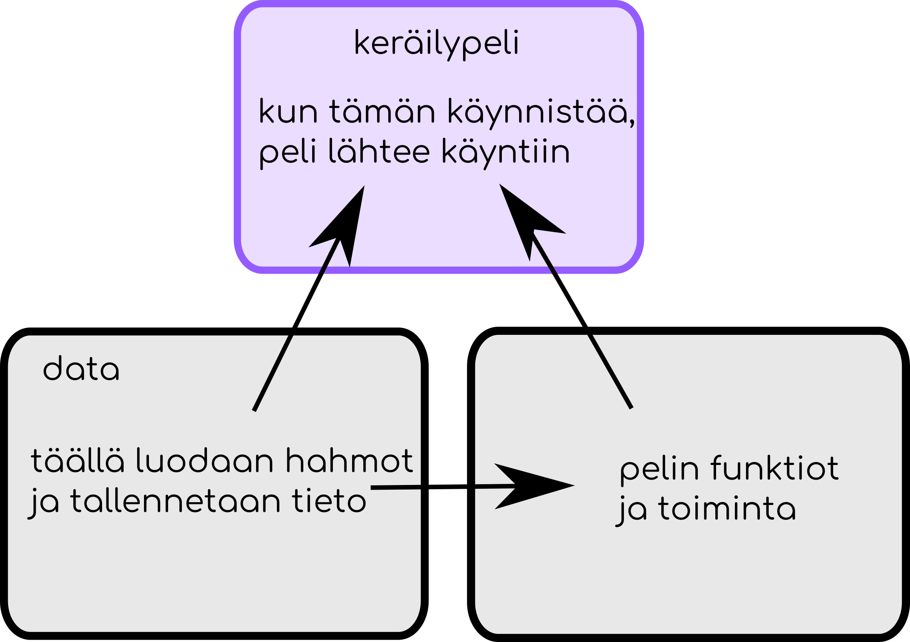

# Keräilypeli

Keräilypelissä kuljetaan ympäri pelikenttää ja keräillään asioita. Asioiden keräämisestä saa pisteitä. Lisäksi kentällä pelaajaa jahtaa pahis, jota kuuluu väistellä. Jos pahis saa pelaajan kiinni, peli päättyy.

## Pelin tiedostorakenne

Viime osassa käsittelimme moduuleja ja nyt kun alamme oikeasti ohjelmoida peliä, on hirveän hyödyllistä, että voimme jakaa koodin useaan eri tiedostoon. Koodin voi tietysti jakaa todella monella eri tavalla, mutta jotkin tavat ovat toisia kätevämpiä. Tässä ohjeessa koodi on jaettu kolmeen tiedostoon seuraavalla tavalla.



## Aloitetaan!

Luodaan ensin kansio mihin tulemme luomaan kaikki tiedostot koodia varten. Nimeä kansio `keräilypeli`.

Luodaan kansioon seuraavaksi päätiedosto, jonka käynnistämällä peli lähtee käyntiin. Annetaan sen nimeksi `keräilypeli.py`.

Avataan tämä tiedosto ja luodaan peliä varten ikkuna. Muista lisätä ensin pyglet! Laitetaan vielä ikkuna aukeamaan.

Tiedosto näyttää nyt siis jotakuinkin tältä:

```Python3
import pyglet

ikkuna = pyglet.window.Window(width = 800, height = 600, caption = 'Keräilypeli')

pyglet.app.run()
```

Kaikki ikkunatapahtumat tullaa kirjoittamaan tähän tiedostoon.

## Luodaan pelaajahahmo

Luodaan seuraavaksi tiedosto, missä luomme ja mihin säilömme kaiken pelin datan. Lisätään kansioon uusi tiedosto nimeltä `data.py`. Avaa tiedosto.

Tässäkin tiedostossa pitää muistaa ensin ottaa pyglet käyttöön. Kannattaa myös tallentaa haluttuja värejä vakiomuuttujiin tiedoston alussa. Voit kopioida hyödylliset värit alla olevasta koodista tiedoston alkuun.

```Python3
PUNAINEN = 255, 0, 0
SININEN = 0, 0, 255
VIHREÄ = 0, 255, 0
VALKOINEN = 0, 0, 0
```

Luodaan pelaaja. Ympyrä sopii hyvin.

data.py tiedosto näyttää nyt siis suunnilleen seuraavalta:

```Python3
import pyglet

PUNAINEN = 255, 0, 0
SININEN = 0, 0, 255
VIHREÄ = 0, 255, 0
VALKOINEN = 0, 0, 0

pelaaja = pyglet.shapes.Circle(x = 100, y = 100, color = PUNAINEN, radius = 40)
```

## Laitetaan ikkuna piirtämään pelaaja

Nyt laitetaan pelaaja näkymään ikkunassa. Kirjoitetaan ikkunatapahtumat tiedostoon `keräilypeli.py`.

Lisätään tiedostoon keräilypeli.py ikkunatapahtuma `on_draw`. Jotta voimme ikkunatapahtumassa piirtää pelaajahahmon, meidän tulee ottaa käyttöö tiedosto, jossa pelaajahahmo luodaan. Lisätään siis `import pyglet`in jälkeen `import data`.

Nyt voimme käyttää pelaajaa. keräilypeli.py:ssä koodilla `data.pelaaja`. Keräilypeli.py:n pitäisi näyttää nyt suunnilleen seuraavalta:

```Python3
import pyglet
import data

ikkuna = pyglet.window.Window(width = 800, height = 600, caption = 'Keräilypeli')

@ikkuna.event
def on_draw():
    ikkuna.clear()
    data.pelaaja.draw()

pyglet.app.run()
```

## Ohjelmoidaan pelaajan liikkuminen

Toteutetaan liikkuminen niin, että tallennetaan muistiin mihin suuntaan ollaan liikkumassa, ja liikkumissuunnan perusteella liikutetaan koko ajan hahmoa. Meidän tarvitsee siis:
1. Luoda mihin tallennamme tiedon liikkumissuunnasta
2. Ohjelmoida napin painaminen muuttamaan liikkumissuntaa
3. Ohjelmoida napin painamisen lopettaminen muuttamaan liikkumissuuntaa
4. Luoda funktio, joka liikuttaa hahmoa liikkumissuunnan mukaisesti.
5. Aikatauluttaa funktio.

Aloitetaan!

### Tallennetaan suunta

Liikkumissuunta on pelin dataa. Luodaan se siis tiedostossa `data.py`.

Liikkumissuunta kannattaa tallentaa dictionaryyn. Käytetään seuraavanlaista:

```Python3
liikkumissuunta = ['ylös' : False, 'alas' : False, 'vasemmalle' : False, 'oikealle' : False]
```

Nyt jos haluamme tietää esimerkiksi liikutaanko ylös, tieto siitä löytyy dictistä komennolla `liikkumissuunta['ylös']`. Tällä hetkellä kaikkien suuntien arvo on `False` eli epätosi. Toisin sanoen mihinkään ei liikuta.

### Laitetaan pelaaja liikkeelle

Tehdään seuraavaksi funktio, joka muuttaa liikkumissuunnan johonkin suuntaan todeksi, jos painetaan suuntaa vastaavaa nuolinäppäintä. Nuolinäppäinten nimet ovat pygletissä: 
- Ylösnuoli on `pyglet.window.key.UP`
- Alasnuoli on `pyglet.window.key.DOWN`
- Nuoli vasemmalle on `pyglet.window.key.LEFT`
- Nuoli oikealle on `pyglet.window.key.RIGHT`

